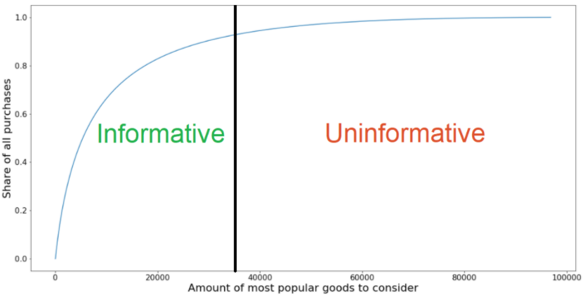

# lenta_hack

# Prepocessing 
Code and files for skoltech/lenta hackaton sept.2020

We analyzed data, clean and split it for better algorithm work by following factors:

Checks with big amount of different items 
(big chance to leave if you haven't found what you need)
 
Type of plate (different customers behavior pattern)

A few most popular items and all low popular items (first - outliers, second - not informative)

Transactions in which there was a wholesale purchase goods
(for example сafe owner buy 100 liters of Coca Cola - outliers)

Examples: 

# PageRank

....
Graph example:

