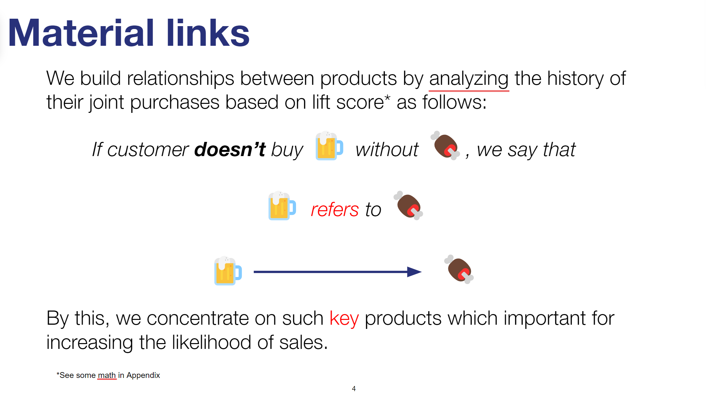
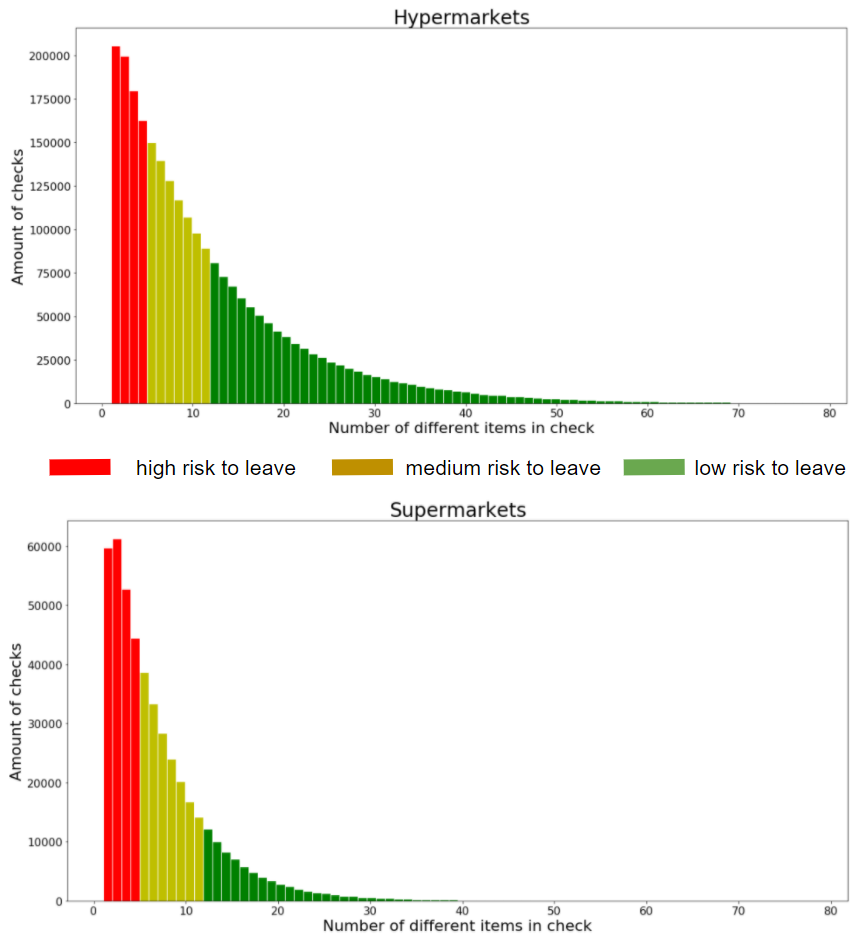
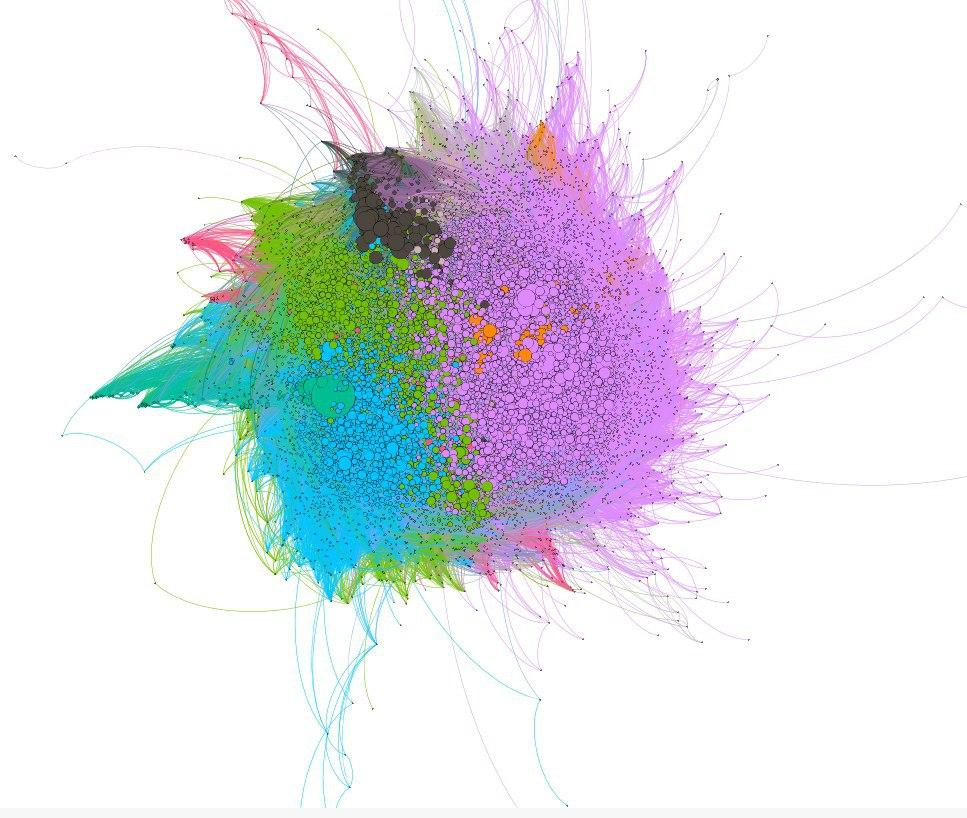

# Lenta-Hackathon

Code and files for lenta hackaton September 2020.

All details you can find in a full [presentation](lenta.pdf). 

# Prepocessing 

### We analyzed data, clean and split it for better algorithm work by following factors:
#### 1. Checks with big amount of different items  (big chance to leave if you haven't found what you need) 
#### 2. Type of plate (different customers behavior pattern)
#### 3. A few most popular items and all low popular items (first - outliers, second - not informative)
#### 4. Transactions in which there was a wholesale purchase goods (for example сafe owner buy 100 liters of Coca Cola - outliers)

# PageRank

Graph example:

